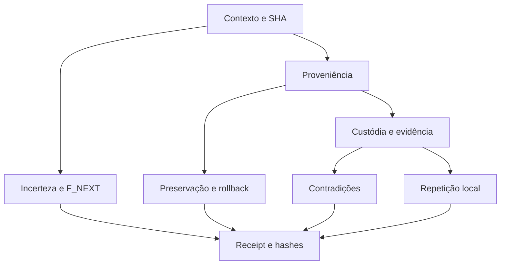

# Ω — pipeline de evidência e evolução operacional

Estado: implementação para revisão; toda execução possui receipt próprio.
Produtor: `rafaelmeloreisnovo/templo-vivo-arcs`.
Baseline inspecionado: `de2a48abba789f2ce71fcf47a4fce0641637dddb`.

> O ferreiro preserva a peça e registra a temperatura antes de mudar o golpe.
> Uma porta que ainda não abriu recebe uma rota de exame; não recebe uma prova inventada.

Esta parábola é uma formulação explicativa contemporânea. As figuras de mestres
utilizadas na proposta do autor não são tratadas aqui como citações históricas.

## Entrega e fronteira

O workflow `Omega Evidence Pipeline` liga contratos existentes, scripts de auditoria,
ledgers de custódia e próximos exames. A execução usa Python 3.9+ e Git, sem instalação
de pacotes Python nem acesso a Drive, segredos, APIs externas ou datasets privados.
Os Actions de checkout/upload usam revisões fixas; seus SHAs foram resolvidos nas
fontes oficiais em 2026-09-18. Atualizações dessas ações precisam de nova revisão.

`SOURCE ≠ ARTEFATO ≠ EXECUÇÃO ≠ EVIDÊNCIA ≠ CLAIM`.
`PASS_SCOPED` atesta o funcionamento dos exames especificados naquela revisão.
`claim_allowed=false` permanece obrigatório: a auditoria pode passar e demonstrar
que o aplicativo, uma hipótese ou uma alegação histórica continua bloqueada.

O protocolo geral está no arquivo [omega-pipeline.v1.json](../../governance/omega-pipeline.v1.json).
A fila está em [omega-exams.v1.json](../../governance/omega-exams.v1.json).
O executor está em [omega_pipeline.py](../../scripts/audit/omega_pipeline.py).
O YAML está em [omega-evidence-pipeline.yml](../../.github/workflows/omega-evidence-pipeline.yml).

## Grafo executável e sete guardas



| Gate | Exame concreto | Falha ou limite |
|---|---|---|
| contexto | SHA esperado, base ancestral, checkout limpo, objetivo | divergência bloqueia dependentes |
| proveniência | bytes de entradas comparados ao commit; SHA-256 e Git blob | hash registra identidade; não prova significado ou autoria |
| custódia | validação do ledger e aplicação das resoluções existentes | resolução não promove capacidade histórica |
| contradição | linhagem autoral, contrato Marte e busca POC-10 | sucesso do exame pode registrar objeto inválido/bloqueado |
| incerteza | cobertura dos nove gaps legados e quatro exames atuais | rota completa não significa gap fechado |
| reprodução | segunda execução do resolvedor e comparação de bytes | `SAME_HOST_REPEAT`; reprodução independente continua pendente |
| rollback | cinco ledgers comparados byte a byte à base verificada | base ausente falha; registros antigos não são normalizados |

Uma falha propaga `BLOCKED` aos dependentes, mantendo as rotas independentes
executáveis. A propagação é o significado operacional de cascata/dominó neste
contrato. Correlação entre palavras, desenhos ou documentos não é usada como
evidência de causalidade. Não existe classificação automática integral do corpus.

## Quatro tintas: tipar antes de operar

| Classe | Entrada aceitável | Gate necessário para mudar de classe |
|---|---|---|
| demonstração | proposição, domínio, hipóteses e prova verificável | revisão da prova e contraexemplos pertinentes |
| convenção | definição, namespace e versão | consistência do contrato e compatibilidade declarada |
| hipótese | mecanismo proposto, variável e falsificador | experimento, resultado, controles e limites |
| parábola | narrativa e mapeamento explicativo | compreensão; nunca promoção direta a prova empírica |
| TOKEN_VAZIO | requisito ausente identificado | fonte ou experimento que satisfaça o requisito exato |

`"0001123"` permanece uma cadeia de sete caracteres até haver conversão tipada
explicitamente autorizada. O teste de preservação rejeita a troca por `"1123"`.

As palavras iniciais da proposta recebem aqui papéis operacionais convencionais:
**providência/providenciar** = ação; **provê/provimento** = recurso ou entrega;
**proveniente/proveniência** = origem e derivação. **Provençal** conserva seu
significado linguístico/geográfico; semelhança gráfica não o torna metadado de
custódia. Não se está afirmando identidade etimológica entre esses termos.

## Direções, dimensões e escalas são namespaces distintos

| Estrutura | Valores | Uso |
|---|---|---|
| Ω7, direção da consulta | direta, inversa, derivativa, antiderivativa, recursiva, ortogonal, integrativa | perguntas e relações tipadas |
| Ω7D já presente neste repositório | temporalidade, proveniência/agentes, integridade, capacidade, convergência, jurídico/PI, falsificabilidade | classificação do dossiê existente |
| sete guardas deste pipeline | proveniência, contexto, evidência, contradição, incerteza, reprodução, rollback | validação operacional |
| S7 | token, bloco, arquivo, projeto, ecossistema, corpus, manifold | escala à qual a evidência se aplica |
| L9 | L/O/T/P/C/R/I/E/A | índice das relações úteis, sem preenchimento obrigatório |

Uma evidência não atravessa escalas sem ponte verificável. `x/y/z` e `1080°`
na proposta permanecem linguagem de navegação. Como convenção local opcional,
três voltas podem significar **identificar → confrontar → reintegrar**; não
demonstram sete eixos físicos nem uma lei de evolução. Direções sem ganho de
evidência ficam sem aplicação; dados ausentes permanecem `TOKEN_VAZIO`.

Os oito ensinamentos tornam-se oito verificações: quatro tintas → classe;
número ausente → tipo; tigela → lacuna protegida; tear → identidade antes de
permutar; ruído → anomalia reproduzível; brasa → linhagem temporal;
Verbo/testemunha → claim com fonte; jardim → F_NEXT com histórico.

## DMAIC aplicado

| Etapa | Saída verificável | CTQ |
|---|---|---|
| Define | intenção, escopo, autoridade, SHA solicitado | um produtor e um objetivo explícitos |
| Measure | manifesto das entradas, logs, baseline | todas as entradas utilizadas vinculadas a bytes e revisão |
| Analyze | resultados de gates e contradições | nenhuma falha dependente convertida em PASS |
| Improve | menor patch e exames falsificáveis | corrigir base Git inválida sem reescrever ledgers |
| Control | receipt, hashes, F_NEXT, reversão | toda execução concluída registra resultado positivo ou negativo |

Métricas emitidas: gates aprovados/gates aplicáveis, entradas vinculadas e exames
abertos. São métricas descritivas desta auditoria. Nível sigma, DPMO, capacidade
estatística e taxa populacional de defeitos permanecem `TOKEN_VAZIO` até existirem
unidade, oportunidade, amostra, janela temporal e medição definidas.

## Execução e receipts

Exemplo na revisão que contém este pipeline:

```bash
python3 -m unittest discover -s tests -p 'test_omega*.py' -v
python3 scripts/audit/omega_pipeline.py \
  --base de2a48abba789f2ce71fcf47a4fce0641637dddb \
  --head "$(git rev-parse HEAD)" \
  --out /tmp/omega-primeira-rodada
cd /tmp/omega-primeira-rodada
sha256sum -c SHA256SUMS
```

Use uma pasta nova a cada execução. Uma saída existente é recusada para preservar
o receipt anterior. Base inexistente, contrato malformado, comando não zero e
timeout geram falha fechada; os dependentes não recebem PASS. O bundle contém:

- `receipt.json`: SHA solicitado/executado, base, ambiente, gates e R3;
- logs por comando: argumentos, código de saída e hashes de stdout/stderr;
- saídas produzidas pelos exames, sem reaproveitar artefatos de comandos falhos;
- `F_NEXT.json`: filas com responsável, prioridade, gatilho, ação e fechamento;
- `summary.md` e `SHA256SUMS`: leitura humana e integridade dos bytes finais.

No GitHub, `workflow-outcome.json` também registra checkout/testes/auditoria.
Um erro nos testes continua sendo falha do workflow mesmo que os sete exames
posteriores consigam rodar. Upload usa `always()` e nome único por run/attempt.
Um encerramento abrupto do host ou indisponibilidade do provedor pode impedir
a gravação/upload; nesse caso a evidência continua ausente, nunca PASS implícito.
Retenção de artifact é 30 dias; preservação durável exige receipt/ponte autorizado.

O workflow não faz merge, deploy, publicação de release ou modificação de regras
do provedor. A fila de exames é acionada por eventos/decisão do responsável, sem
agenda recorrente. A existência do YAML não significa branch protection ativa.

## Findings da leitura inicial

1. A árvore em `de2a48a` contém 284 arquivos rastreados; isto é inventário de paths,
   não classificação semântica completa de 284 artefatos.
2. `check_append_only.py` no baseline retornou PASS para base `000…000` inexistente.
   A correção exige objeto commit verificável antes de considerar um ledger novo.
   A comparação passou de linhas normalizadas para prefixo exato de bytes.
3. [Flutter run 35080678482](https://github.com/rafaelmeloreisnovo/templo-vivo-arcs/actions/runs/35080678482)
   falhou no `pub get`: Dart 3.1.0 incompatível com a exigência Dart >=3.4.0 do
   `yaml >=3.1.3`. Build APK e upload foram pulados. Este pipeline registra a rota
   de correção, sem alterar o aplicativo histórico.
4. Custódia e autoria passaram em `bad9becf…`, revisão anterior. Não são execução
   do head posterior. A nova auditoria identifica explicitamente seu próprio SHA.
5. A leitura de `branches/main` informou proteção desativada. Regras do provedor
   e promoção são uma fronteira de autoridade separada; permanecem exame P0.

## Evolução limitada e retroalimentação

O exemplo `goto cONtinua` expressa recorrência. Se a ordem pretendida for
`n' = n + a + 1; a' = n' + a`, trata-se de atualização sequencial definida;
trocar a ordem muda o sistema. Crescimento numérico não mede aprendizado.
O executor usa **uma rodada finita por invocação** e encerra depois do receipt
e da fila. Nova rodada exige dado, hipótese de teste ou decisão material nova.

Correção usa `parent/supersedes`; uma execução posterior registra quais exames
fechou, em qual SHA, sob qual gate. A lista V1 é o estado **aberto no registro**,
não uma promessa de que seus itens permanecerão abertos para sempre.
Não se modifica retroativamente uma observação antiga para apresentar sucesso.

R3: F_ok = contrato e exames executados conforme receipt;
F_gap = contradições, objetos bloqueados e provas ausentes;
F_next = menor exame capaz de fechar um gap dentro da autoridade disponível.

## Fontes técnicas

- [Sintaxe de workflows](https://docs.github.com/en/actions/reference/workflows-and-actions/workflow-syntax).
- [Contextos GitHub Actions](https://docs.github.com/en/actions/reference/workflows-and-actions/contexts).
- Contratos produtores: `OPERATIONAL_ACTION_CONTRACT_V1.json`,
  `FINALIZATION_ROUTE_CONTRACT_V1.json`, `PROVENANCE_RECEIPT_SCHEMA_V1.json`.
- `governance/INTERACTION_FEEDBACK_EVOLUTION_PROTOCOL_V1.md`.
- `docs/auditoria/omega7d/OMEGA_SINTESE_PERMUTACIONAL.md`.
- `docs/MAPA_PUBLICO_TEMPLO_VIVO_ARCS_20260904.md`.
